# Conteneurs Addok pour Docker

Ces images permettent de simplifier grandement la mise en place d'une instance [addok](https://github.com/addok/addok) avec les données de références diffusées par la [Base Adresse Nationale](https://adresse.data.gouv.fr).

## Plateformes

Les images Docker sont disponibles pour `linux/amd64` et `linux/arm64`. Elles sont donc parfaitement utilisables sur Apple Silicon ou Raspberry Pi sans couche d’émulation.

## Composants installés

| Nom du composant | Version |
| --- | --- |
| `redis` | `7.x` |
| `python` | `3.10.x` |
| `addok` | `1.0.3` |
| `addok-fr` | `1.0.1` |
| `addok-france` | `1.1.3` |
| `addok-csv` | `1.0.1` |
| `addok-sqlite-store` | `1.0.1` |
| `gunicorn` | `20.1.0` |

## Guides d'installation

Les guides suivants ont été rédigés pour un environnement Linux ou Mac. Ils peuvent être adaptés pour Windows.

### Pré-requis

* Au moins 6 Go de RAM disponible (à froid)
* 8 Go d'espace disque disponible (hors logs)
* [Docker CE 1.10+](https://docs.docker.com/engine/installation/)
* [Docker Compose 1.10+](https://docs.docker.com/compose/install/)
* `unzip` ou équivalent
* `wget` ou équivalent

### Installer une instance avec les données de la Base Adresse Nationale

Tout d'abord placez vous dans un dossier de travail, appelez-le par exemple `ban`.

#### Télécharger les données pré-indexées

```bash
wget https://adresse.data.gouv.fr/data/ban/adresses/latest/addok/addok-france-bundle.zip
```

#### Décompresser l'archive

```bash
mkdir addok-data
unzip -d addok-data addok-france-bundle.zip
```

#### Télécharger le fichier Compose

```bash
wget https://raw.githubusercontent.com/BaseAdresseNationale/addok-docker/master/docker-compose.yml
```

#### Démarrer l'instance

Suivant votre environnement, `sudo` peut être nécessaire pour les commandes suivantes.

```bash
# Attachée au terminal
docker-compose up

# ou en arrière-plan
docker-compose up -d
```

Suivant les performances de votre machine, l'instance mettra entre 30 secondes et 2 minutes à démarrer effectivement, le temps de charger les données dans la mémoire vive.

* 90 secondes sur une VPS-SSD-3 OVH (2 vCPU, 8 Go)
* 50 secondes sur une VM EG-15 OVH (4 vCPU, 15 Go)

Par défaut l'instance écoute sur le port `7878`.

#### Tester l'instance

```bash
curl "http://localhost:7878/search?q=1+rue+de+la+paix+paris"
```

### Paramètres avancés

| Nom du paramètre | Description |
| ----- | ----- |
| `WORKERS` | Nombre de workers addok à lancer. Valeur par défaut : `1`. |
| `WORKER_TIMEOUT` | [Durée maximale allouée à un worker](http://docs.gunicorn.org/en/0.17.2/configure.html#timeout) pour effectuer une opération de géocodage. Valeur par défaut : `30`. |


# Azure Déploiement

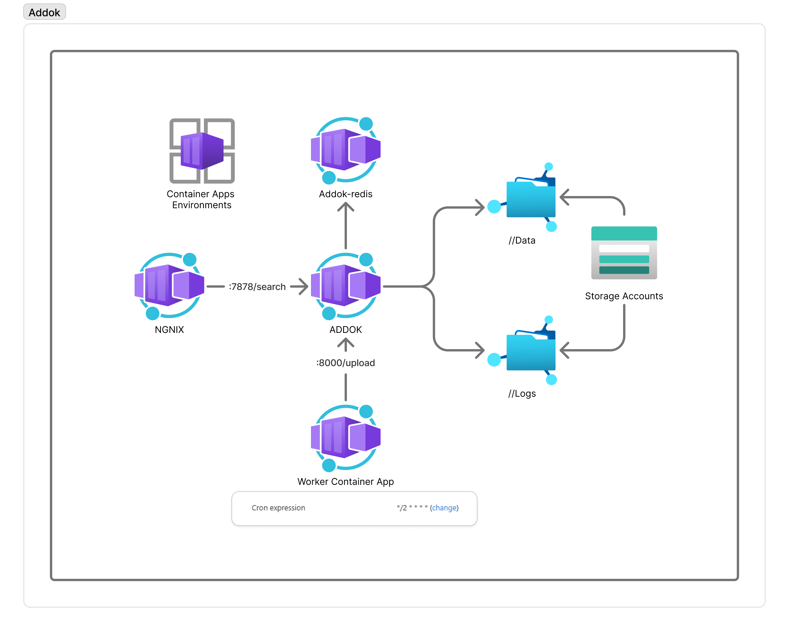

## Architecture déployée (`infra/main.bicep`)

```bash
azd auth login
azd env new test                             #replacer par vos propres valeurs
azd env set AZURE_LOCATION francecentral     #replacer par vos propres valeurs
azd env set ACR_NAME addokdev1235            #replacer par vos propres valeurs
azd env set AZURE_RESOURCE_GROUP test-addok  #replacer par vos propres valeurs
auth login
```

```bash
az login
az group create --location $(azd env get-value AZURE_LOCATION) --resource-group $(azd env get-value AZURE_RESOURCE_GROUP)
az acr create -n $(azd env get-value ACR_NAME) -g $(azd env get-value AZURE_RESOURCE_GROUP) --sku Basic
azd up
```

Le fichier `infra/main.bicep` provisionne les ressources suivantes :

- **Log Analytics Workspace** (`Microsoft.OperationalInsights/workspaces`)
- **Application Insights** (`Microsoft.Insights/components`)
- **Azure Container Apps Environment** (`Microsoft.App/managedEnvironments`)
- **Azure Storage Account** pour les données Addok (`Microsoft.Storage/storageAccounts`)
  - **Azure File Share** pour les données (`fileServices/shares`)
  - **Azure File Share** pour les logs (`fileServices/shares`)
- **Azure Container Registry** (`Microsoft.ContainerRegistry/registries`)
- **Managed Identity** pour l'accès au registre (`Microsoft.ManagedIdentity/userAssignedIdentities`)
- **Role Assignment** pour l'accès ACR (`Microsoft.Authorization/roleAssignments`)
- **Container App Addok** (`Microsoft.App/containerApps`)
   - image `addock` ecoute port 7878
   - image `addock_importer` port 8000 expose une api pour déclencher le chargement du fichier JSON [addok-importer/api.py](addok-importer/api.py)
- **Container App Redis** (`Microsoft.App/containerApps`)
- **Container App Nginx** (`Microsoft.App/containerApps`)
- **Job Importer** (`Microsoft.App/jobs`) Déclenchment via une expression cron (chaque 2 minutes dans l'exemple) et declenchement `addok_importer:8000/upload` via une command `curl`

L'ensemble de ces ressources permet de déployer une stack Addok scalable et managée sur Azure.

## Procédure de déploiement

1. **Authentification Azure**
   ```bash
   azd auth login
   ```

2. **Déploiement de l’infrastructure**
   ```bash
   azd up
   ```
   Cette commande déploie tous les composants définis dans `infra/main.bicep`.

3. **Import des images dans l'azure container registry*
Pour importer l’image Docker Addok dans votre Azure Container Registry (ACR), utilisez le script `import_images.sh` fourni dans ce dépôt. Ce script télécharge l’image depuis Docker Hub, la tague pour votre registre, puis la pousse dans votre ACR.

```bash
# Syntaxe : ./import_images.sh <nom-acr>
./import_images.sh <nom-de-votre-acr>
```

Remplacez `<nom-de-votre-acr>` par le nom de votre registre (sans le suffixe `.azurecr.io`).  
Exemple : si votre ACR s’appelle `monaddokacr`, la commande sera :

```bash
./import_images.sh monaddokacr
```

L’image sera alors disponible dans votre registre Azure et pourra être utilisée par vos déploiements.

3. **Chargement des données dans le stockage Azure**
   Récupérez les variables d’environnement générées :
   ```bash
   AZURE_RESOURCE_GROUP=$(azd env get-value AZURE_RESOURCE_GROUP)
   AZURE_STORAGE_ACCOUNT=$(azd env get-value STORAGE_ACCOUNT_NAME)
   ./upload.sh $AZURE_RESOURCE_GROUP $AZURE_STORAGE_ACCOUNT
   ```
   Le script `upload.sh` charge les données nécessaires dans le partage de fichiers Azure.

5. **Redémarrage du service**
   
   ```bash
   AZURE_RESOURCE_GROUP=$(azd env get-value AZURE_RESOURCE_GROUP)
   az login
   az containerapp update --name addokapp -g $AZURE_RESOURCE_GROUP --set-env-vars RESTART_TRIGGER=$(date +%s) --container-name addok
   # Test l'etat du service
   az containerapp revision list -n addokapp -g $AZURE_RESOURCE_GROUP --output table
   ```

6. **Récupérer l’URL publique de l’API Addok**
   ```bash
   ADDOK_FQDN=$(azd env get-value ADDOK_FQDN)
   curl "https://${ADDOK_FQDN}/search?q=1+rue+de+la+paix+paris"
   ```

## Personnalisation

Les paramètres principaux (nombre de workers, timeout, logs, etc.) sont configurables dans le fichier Bicep via les paramètres :
- `WORKERS`
- `WORKER_TIMEOUT`
- `LOG_QUERIES`
- `LOG_NOT_FOUND`
- `SLOW_QUERIES`

Vous pouvez les ajuster dans le fichier `main.parameters.json` avant le déploiement.


# Déploiement Addok sur Azure via le Portail Azure

Ce guide explique comment déployer l’infrastructure Addok (équivalent du fichier `main.bicep`) en utilisant le portail Azure.

---

## 1. Créer un groupe de ressources

- Accédez à **Groupes de ressources** > **Créer**.
- Renseignez le nom et la région.
- 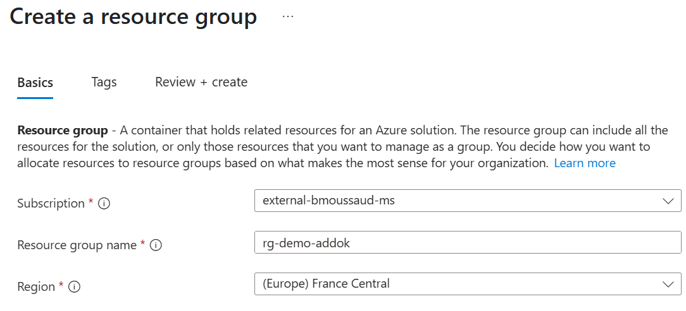

---

## 2. Créer un Log Analytics Workspace

- Accédez à **Log Analytics workspaces** > **Créer**.
- Remplissez les champs requis.
- 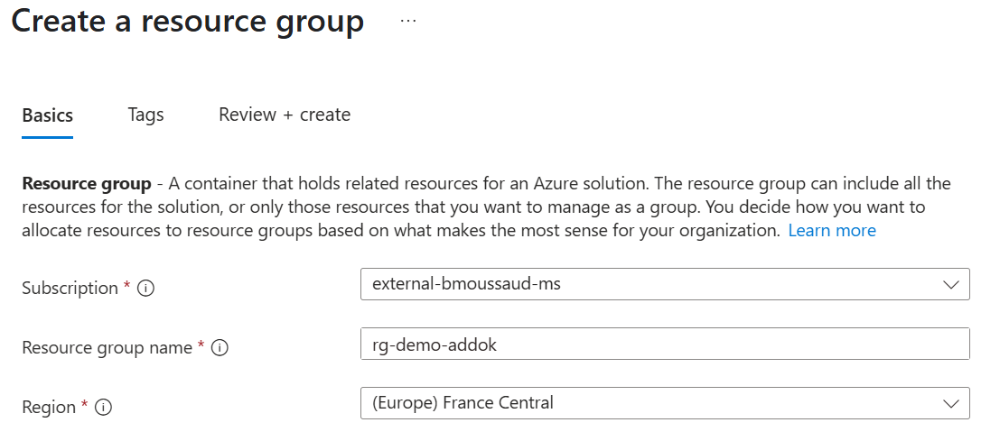

---

## 3. Créer une Application Insights

- Accédez à **Application Insights** > **Créer**.
- Sélectionnez le même groupe de ressources et la même région.
- Liez-le au Log Analytics Workspace créé précédemment.
- 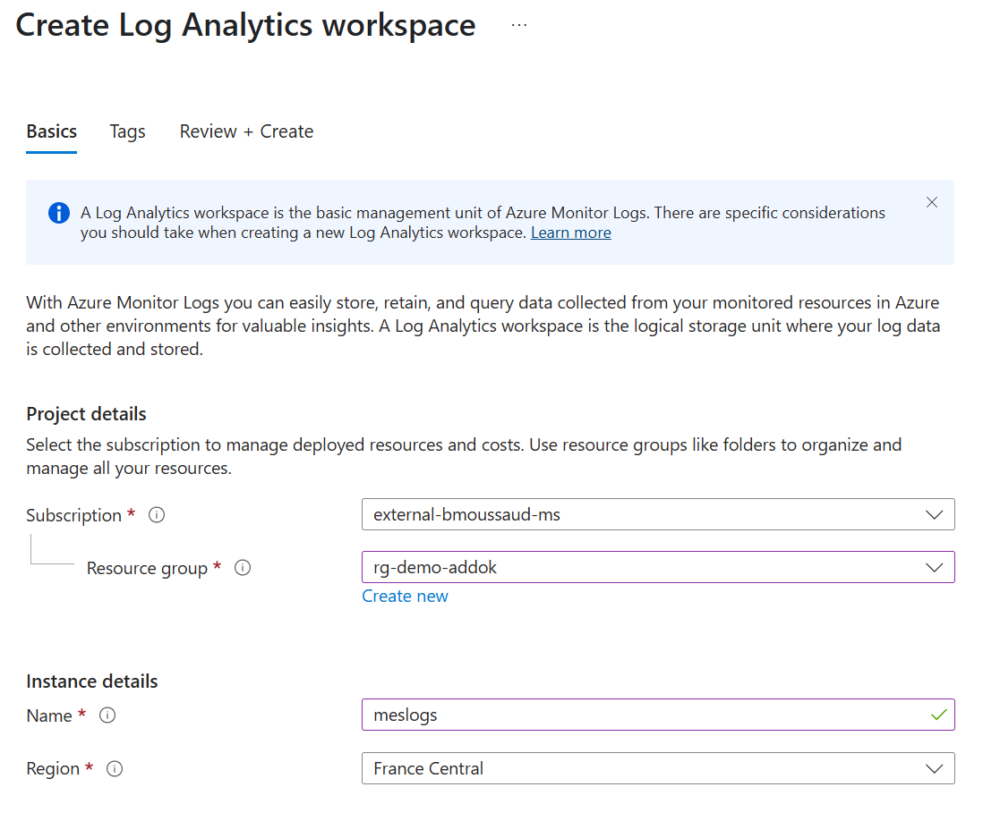

---

## 4. Créer un compte de stockage

- Accédez à **Comptes de stockage** > **Créer**.
- Choisissez le type **StorageV2** et activez **Large file shares**.
- Primary Service: **Azure Files**
- Performance **Standard**
- Option par défault.
- Deuxieme Page: 
   - `Allow enabling anonymous access on individual containers`
- 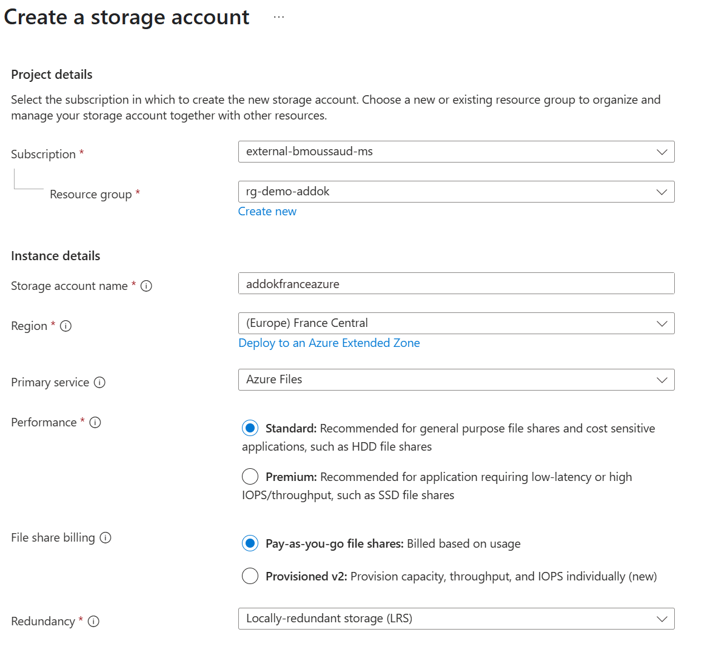
- 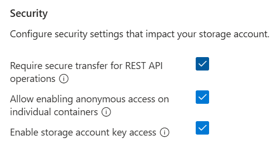

---

## 5. Créer deux Azure File Shares

- Dans le compte de stockage, allez dans **Partages de fichiers** > **Ajouter** :
  - `addokfileshare` (quota 10 Go)
  - `addoklogfileshare` (quota 10 Go)
- Décoche `Backup`
- 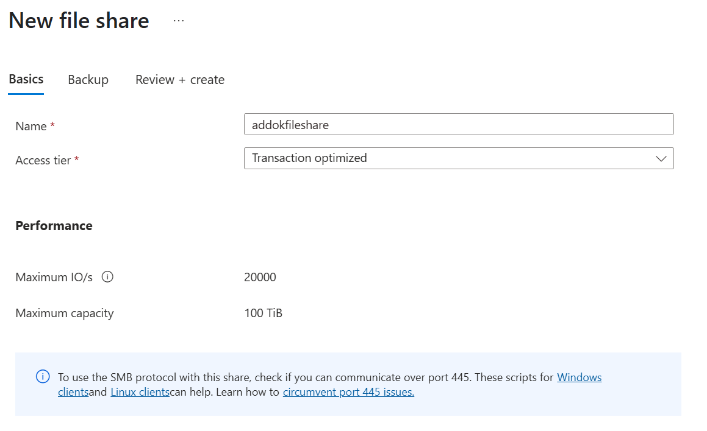

---

## 7. Créer l’application Container App principale (`addokapp`)

- Accédez à **Container Apps** > **Créer**.
- Creer un nouvel environement 
- Ajoutez le conteneur `etalab/addok` utisant le Docker Hub
   - image alternative pour la configuration : mavilleg/acarevision-helloworld:acarevision-hellowold
- Configurez les variables d’environnement 
   - `WORKERS`:`1`
   - `WORKER_TIMEOUT`: `30`
   - `LOG_QUERIES`: `1`
   - `LOG_NOT_FOUND`: `1`
   - `SLOW_QUERIES`: `200`
   - `REDIS_HOST`: `localhost`
   - `PORT`:`7878`
- Configurez l’ingress (port 7878, public).
- Ajoutez les montages de volumes Azure File Share (`addokfileshare` et `addoklogfileshare`) aux bons chemins (`/data`, `/etc/addok`, `/logs`).
- Ajoutez les probes de démarrage, liveness, readiness sur le port 7878.
- 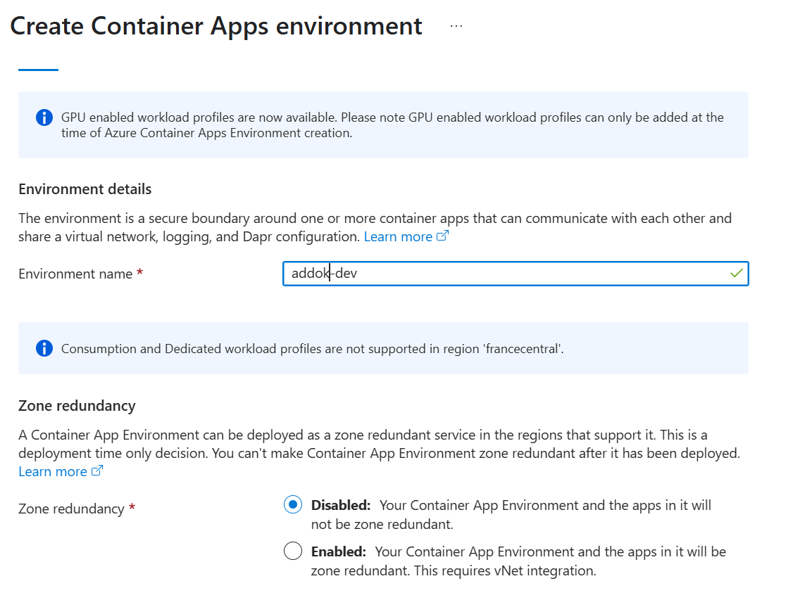
- 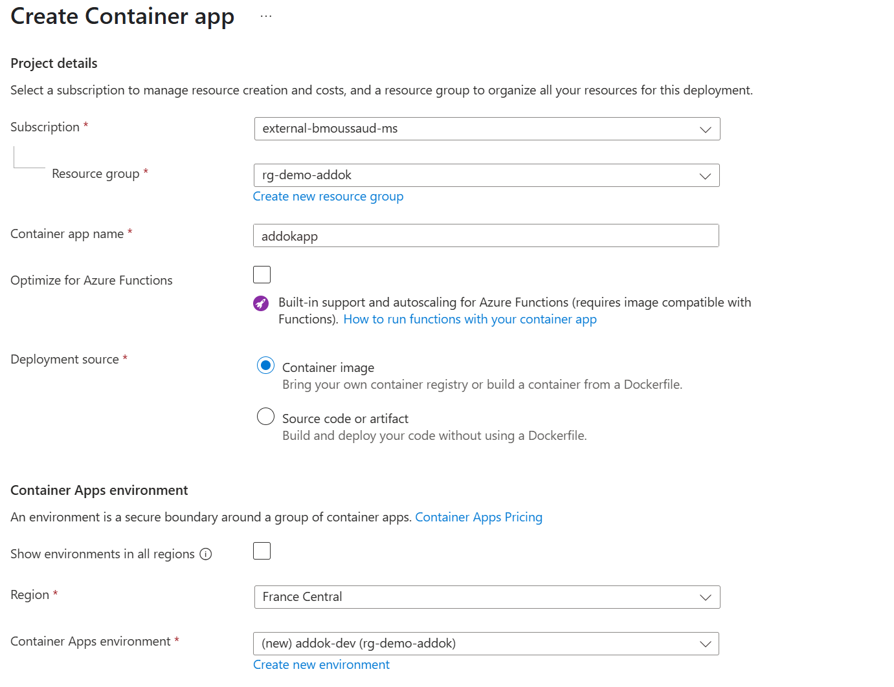
- 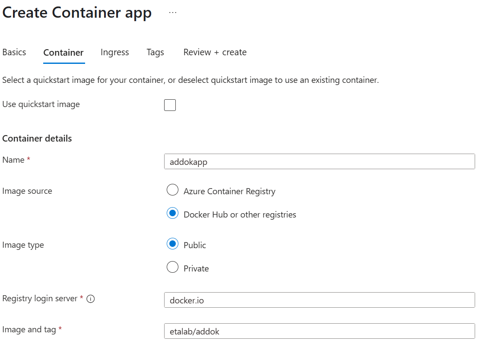
- 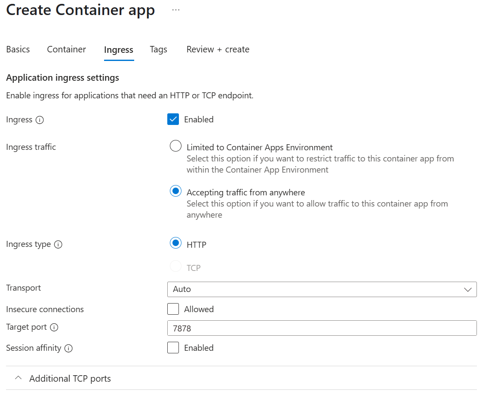
---

## 8. Ajouter le conteneur Redis (`addok-redis`) dans la même Container App

- Ajoutez le conteneur `etalab/addok-redis`. Aller dans le Container `addokapp`, `Containers`, `Créer un nouveau container`. 
   - image alternative pour la configuration : mcr.microsoft.com/azuredocs/containerapps-helloworld:latest
- Configurez les probes sur le port 6379 et mettre la variable d_env PORT=6379
- Montez le volume Azure File Share sur `/data`.
- 
---

## 10. Ajouter les Azure Files à l'environment

- Recuperer l'`access key` du Storage Account 
- Allez dans l'environement Container Apps
- Allez dans `Azure Files`
- Ajouter SMB
   - `addokfileshare` Read 
   - `addoklogfileshare` Read Write
- 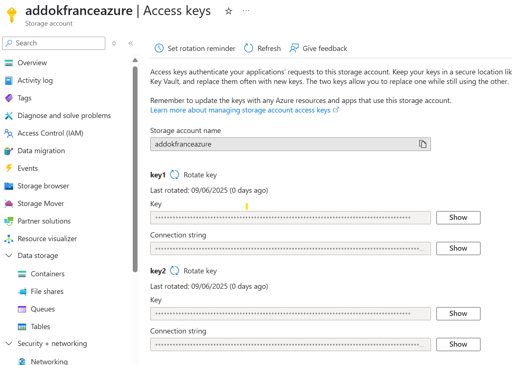
- 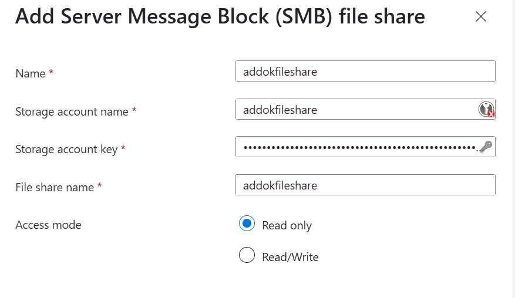

# 11. Ajouter les volumes aux containers:

- lancer la commande `az containerapp show -n $APP_NAME -g $RESOURCE_GROUP_NAME -o yaml > app.yaml`
- Editer le fichier pour ajouter une section volume:
```yaml
   volumes:
    - name: share-volume
      storageName: addokfileshare
      storageType: AzureFile
    - name: logs-volumes
      storageName: addoklogfileshare
      storageType: AzureFile
```
- Editer le fichier pour ajouter pour chaque container le `volumeMount` suivants

```yaml
- name: addokapp
  volumeMounts:
   - mountPath: /data
     volumeName: share-volume
     subPath: data
   - mountPath: /etc/addok
     volumeName: share-volume
     subPath: addock
   - mountPath: /log
     volumeName: logs-volumes
....
- name: addokapp
  volumeMounts:
   - volumeName: 'share-volume'
     mountPath: '/data'
     subPath: 'redis'
```
- lancer la commande pour mettre a jour le container `az containerapp update -n $APP_NAME -g $RESOURCE_GROUP_NAME --yaml app.yaml`

## 9. Configurer le scaling et les ressources

- Définissez les ressources CPU/mémoire pour chaque conteneur.
- Définissez le nombre de réplicas min/max.
- 

---

## 10. Récupérer l’URL publique de l’application

- Une fois déployée, l’URL publique (FQDN) sera affichée dans la configuration d’ingress de la Container App.
- 

---

## Chargement des données dans Azure File Share via le portail Azure

1. **Téléchargez le fichier de données**
   - Si vous ne l’avez pas déjà, téléchargez le fichier [`addok-france-bundle.zip`](addok-france-bundle.zip) depuis :  
     [https://adresse.data.gouv.fr/data/ban/adresses/latest/addok/addok-france-bundle.zip](https://adresse.data.gouv.fr/data/ban/adresses/latest/addok/addok-france-bundle.zip)

2. **Décompressez le fichier**
   - Décompressez l’archive dans un dossier local nommé `addok-data`.
   - Vous obtiendrez au moins les fichiers suivants :
     - `addok.conf`
     - `dump.rdb`
     - `addok.db`

3. **Accédez à votre compte de stockage dans le portail Azure**
   - Ouvrez le portail Azure.
   - Accédez à votre **Compte de stockage** utilisé pour Addok.
   - Dans le menu, cliquez sur **Partages de fichiers** puis sur le partage `addokfileshare`.

4. **Créez les dossiers nécessaires**
   - Dans le partage de fichiers, créez les dossiers suivants si besoin :
     - `addok`
     - `redis`
     - `data`

5. **Chargez les fichiers dans les bons dossiers**
   - Dans le dossier `addok`, chargez le fichier `addok.conf`.
   - Dans le dossier `redis`, chargez le fichier `dump.rdb`.
   - Dans le dossier `data`, chargez le fichier `addok.db`.

   *(Utilisez le bouton "Charger" dans l’interface Azure pour chaque fichier.)*

6. **Vérifiez que tous les fichiers sont bien présents dans les bons dossiers.**


